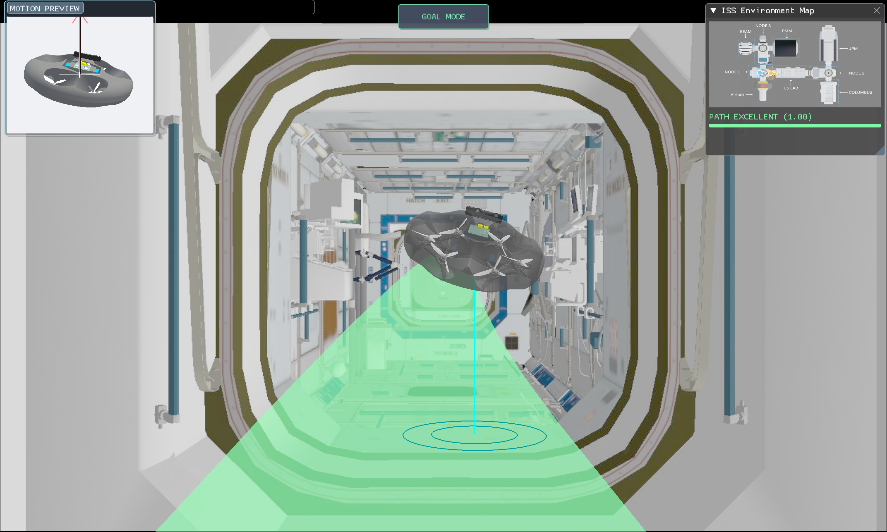

# SpaceBotLink



SpaceBotLink is a multimodal teleoperation interface for a free-flying 
robots operating in $\mathrm{SE}(3)$ under multi-second communication latency
(e.g. the ~3 s round-trip imposed by Earth-to-Moon links). It is the operator
side of the system described in the paper *Enhancing Multi-Second Delay
Teleoperation Effectiveness Through Shared Autonomy and Multimodal Interface*.

The interface runs on the ground operator's workstation and renders the
robot's delayed camera feed as the background of a Panda3D scene, composited
with a semi-transparent **avatar** (a virtual proxy of the robot), a planned
**path ribbon**, and a HUD showing mode, latency, path-quality, orientation,
and an ISS map overlay. The operator commands the avatar; the robot follows
autonomously, decoupling command entry from the latency window.

## What it provides

- **Avatar-based surrogate control.** Steer a virtual proxy in real time; the
  robot tracks it autonomously over the delayed link.
- **Two control modes.**
  - **Goal Mode** — publish a single $\mathrm{SE}(3)$ goal pose; the onboard
    planner generates a collision-free path and the controller executes it.
  - **Follow Mode** — stream the avatar's continuous trail as a waypoint
    sequence the robot tracks directly (no replanning, no automatic obstacle
    avoidance).
- **Predictive display.** The planned-path ribbon shows the route the robot
  will execute, recoloured by per-segment collision risk.
- **Avatar feasibility colouring.** White = clear pose with line of sight;
  orange = pose reachable but occluded; red = pose inside an occupied voxel.
  Computed locally via raycast against an OctoMap (`assets/iss.bt` consumed by
  the bundled C++ raycast service).
- **Path-quality badge.** Monte-Carlo collision-risk score from the onboard
  evaluator, rendered as *Excellent / Good / Risky / Critical*.
- **Situation-awareness aids.** Round-trip delay fill bar, third-person motion
  preview with ISS-up arrow, ground-projection disc, and 2D ISS map overlay.
- **Abort.** Clears the robot's waypoint buffer and pins it at its current pose.

## Companion repo (robot side & simulation)

The robot-side stack — Gazebo simulation, ROS 2 node graph, `nav6d`
planner/evaluator/controller, and ZMQ↔ROS bridge — lives in:

> https://github.com/SpaceBotsISR/software_cobot

Bring it up first; SpaceBotLink will connect to it over ZMQ.

## Launching the simulation environment

All simulation is done inside the Docker container shipped by
`software_cobot`. From a checkout of that repo, start the container (refer to
its README for `docker compose` / dev-container details), then **inside the
container** run two launch files in two separate shells:

```bash
# Shell 1 — Gazebo + robot bringup + ZMQ bridge
ros2 launch space_cobot_bringup teleop.launch.py

# Shell 2 — onboard autonomy: planner + path evaluator + controller
ros2 launch nav6d nav6d.launch.py
```

Once both are running you should see the simulated ISS interior in Gazebo and
the robot publishing pose / image / path topics over ZMQ.

## Launching the interface

SpaceBotLink uses [`uv`](https://docs.astral.sh/uv/) for Python environment
management. Python 3.12 is required (enforced by `.python-version`).

### 1. Install dependencies

```bash
uv sync
```

### 2. Build the OctoMap raycast service (one-time)

```bash
cd octomap_raycast_service
mkdir -p build && cd build
cmake .. && make
cd ../..
```

The resulting binary is auto-spawned by `main.py`; you do not need to launch
it manually.

### 3. Run the interface

```bash
uv run src/main.py 
```

The app reads from `src/config.py` for ZMQ endpoints, camera intrinsics,
input tuning and other config values. The input daemon (for connecting a gamepad or a SpaceMouse to the interface) autostart is selected
by `REMOTE_INPUT_DAEMON` in `config.py` (default: `"spacemouse"`; other
options: `"gamepad"`, `"both"`, `"none"`). Override at runtime with the
environment variable of the same name:

```bash
REMOTE_INPUT_DAEMON=gamepad uv run python -m src.main
```

## Controls

The avatar is the default control target in both Goal and Follow Mode.

Translation is **camera-relative**: forward is always away from the operator's
viewpoint regardless of robot attitude, which matters in microgravity where
the robot can be at any orientation.

Three input devices are supported as **alternatives** — pick whichever one is
plugged in. The SpaceMouse is the recommended primary device; the gamepad and
keyboard are fully functional fallbacks. Only one needs to be active at a
time, and they all drive the same avatar/abort/mode-toggle actions.

### Option A — SpaceMouse (3Dconnexion, recommended)

A 6-DoF puck mapping all axes to a single knob. Push, pull, and twist the cap
for simultaneous translation and rotation; signal conditioning (deadzone,
power-law curve, low-pass smoothing, axis lock) is applied in
`spacemouse_daemon.py` before publishing to the interface.

| Input | Action |
| --- | --- |
| Push knob forward / back | Move avatar forward / back |
| Slide knob left / right | Strafe left / right |
| Lift / press knob | Move up / down |
| Twist knob (yaw) | Yaw |
| Tilt knob fore/aft (pitch) | Pitch |
| Tilt knob side/side (roll) | Roll |
| Left button | Abort (clear path, hold pose) |
| Right button | Toggle Goal / Follow mode |

### Option B — Console gamepad (PlayStation / Xbox layout)

Read by `gamepad_daemon.py` via the `inputs` library and republished over
ZMQ. Button names below use a DualShock-style layout; Xbox equivalents are in
parentheses.

| Input | Action |
| --- | --- |
| Left stick | Translate forward / back / strafe |
| R2 / L2 triggers | Up / down |
| Right stick | Pitch / roll (avatar) or pitch / roll (direct mode) |
| L1 / R1 (LB / RB) | Yaw left / right |
| Touchpad | Abort — stop robot, clear path |
| Cross (A) | Toggle Goal / Follow mode |

### Option C — Keyboard

The keyboard is the fallback when no SpaceMouse or gamepad is connected, and
also useful for orientation nudges during testing.

| Key | Action |
| --- | --- |
| `W` / `S` | Forward / back |
| `A` / `D` | Strafe left / right |
| `Q` / `E` | Down / up |
| `U` / `O` | Yaw left / right |
| `I` / `K` | Pitch up / down |
| `J` / `L` | Roll left / right |
| `T` | Toggle Goal / Follow mode** |
| `Space` | Abort — stop robot, clear waypoint buffer, hold at current pose |

Direct-mode toggle, path-visualisation style, and other settings are exposed
in the ImGui side panel.

## Repository layout

```
src/
  main.py                  # Panda3D app, task loop, subprocess management
  renderer.py              # Scene, avatar, path ribbon, ground projection, ISS detection
  ui.py                    # ImGui overlay (mode, path quality, ISS map, settings)
  input_controller.py      # Keyboard / gamepad / SpaceMouse handling
  navigation.py            # Goal / Follow state machine, waypoint pruning, abort
  teleop_bus.py            # ZMQ SUB/PUB, JSON parsing, image decode
  avatar.py                # Two-pass transparent GLTF rendering
  utils.py                 # ROS↔Panda3D coordinate conversions
  config.py                # All tunable constants
  gamepad_daemon.py        # Standalone gamepad → ZMQ publisher
  spacemouse_daemon.py     # Standalone SpaceMouse → ZMQ publisher
octomap_raycast_service/   # C++ subprocess for collision/risk queries
config/iss_modules.yaml    # Reference points for ISS module classification
assets/                    # GLTF models, ISS map, OctoMap
```

ROS uses ENU (X-forward, Z-up); Panda3D uses Y-forward, Z-up. All conversions
are centralised in `utils.py` (`ros_to_p3d_pos`, `ros_to_p3d_hpr`).

## License

See `LICENSE`.
